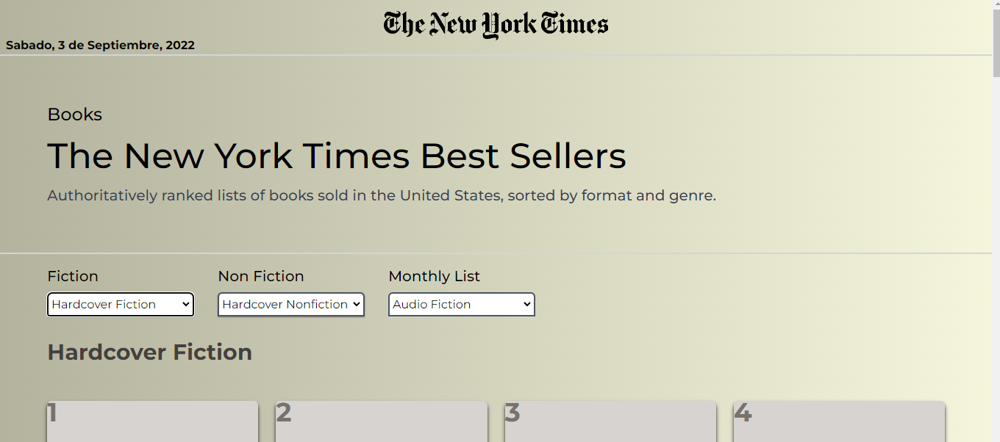
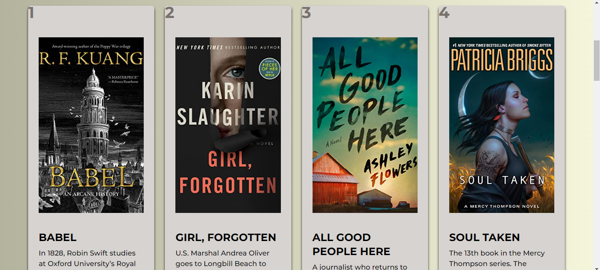

# Best Sellers Books app - The New York Times by Matias Arias

This is an application to allow us find a list through diferent categories of the best sellers books by the new york times. I built the entire app with React, JavaScript and Tailwind. I used for the data the api of the New york times. I really hope you like it.

## Link

Deploy Site: [https://the-new-york-times-books-app.vercel.app/](https://the-new-york-times-books-app.vercel.app/)

## Screenshots

---

## Api

for the data requests i used the api of the new york times [https://developer.nytimes.com/docs/books-product/1/overview](https://developer.nytimes.com/docs/books-product/1/overview)

## Built with

- React
- Javascript
- Tailwind
- react-hooks
- react icons
- react-router-dom
